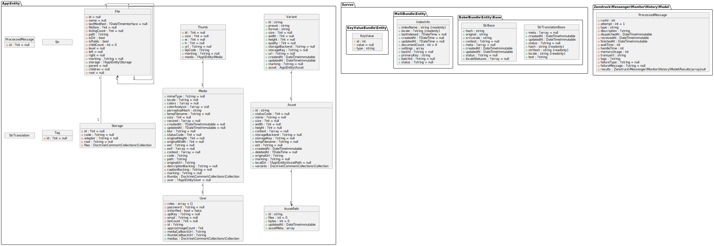
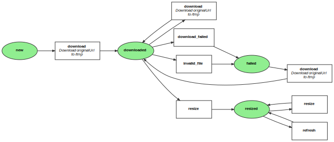
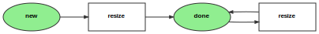
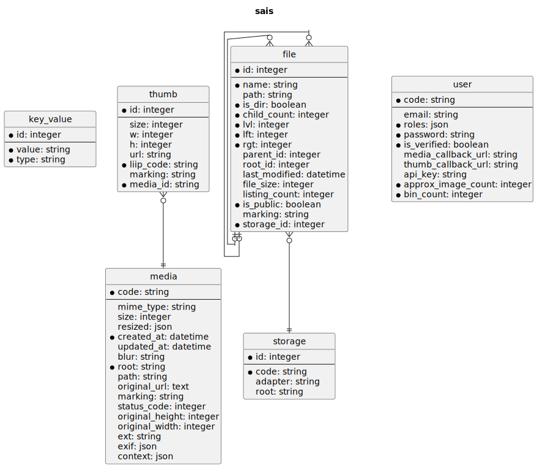

# Survos Async Image Server (SAIS)

This application is based on the LiipImagineBundle, but instead of dynamically creating images on the fly, it creates them asynchronously and sends a callback to the client when finished.   It uses [flysystem](https://github.com/thephpleague/flysystem-bundle) so the storage is flexible.  The main purpose is to NOT freeze the system if a thumbnail has not been generated, but also have a central repository for image analysis tools.

There are some tools for working directly with the server, but most of the time images are loaded from a client application, like museado, via the survos/sais-bundle.  Each client has its own "key", which is used for authentication as the root of the source images (on S3) and resized images stored locally in the media cache.



## JSON-RPC

curl -H 'Content-Type: application/json' -d '{"jsonrpc":"2.0", "method":"tools/list"}' -x 127.0.0.1:7080 https://sais.wip/tools | jq

curl -H 'Content-Type: application/json' \
   -d '{"jsonrpc":"2.0","method":"tools/create_account","id": "unique", "params":{"root": "rpc", "estimated":100}}' -x 127.0.0.1:7080 https://sais.wip/tools | jq

curl -H 'Content-Type: application/json' \
-d '{"jsonrpc":"2.0","method":"tools/list","id": "unique", "params":{"root": "rpc", "estimated":100}}'  https://127.0.0.1:8018/mcp | jq


curl -H 'Content-Type: application/json' -d '{"jsonrpc":"2.0", "method":"tools/list"}' https://127.0.0.1:8018/mcp | jq

curl -H 'Content-Type: application/json' -d '{"jsonrpc":"2.0", "method":"tools/sum_numbers"}' https://127.0.0.1:8018/mcp | jq


## Developers

The survos/sais-bundle defines the _structures_ that are used by both the client and server.  So the setup.

Note: see https://medium.com/@laurentmn/optimizing-image-handling-in-symfony-with-liipimaginebundle-pro-tips-use-cases-7f55819deb80 for configuring thumbnails to be on S3

```bash
# the monorepo for the bundles
git clone git@github.com:survos/survos.git
git clone git@github.com:survos-sites/sais.git && cd sais
composer install
../survos/link .

cd ..
git clone git@github.com:survos-sites/dummy.git && cd dummy
composer install
../survos/link .
# see the dummy readme to load it
```

Each client, aka museado, pgsc, dummy, voxitour, etc. is registered as a User with a code (for eventual security).  The code is also the root path on the storage.

The client registration endpoint is at https://sais.wip/ui/account_setup, it must be called at least once so that the files can be stored in the proper directory.

This can be called from the client using sais-bundle

```php
$client->accountSetup(new AccountSetup('test', 5000));
```

or called via JSON RPC MCP (See bundle docs for more details):
```php
$arguments = (array) new AccountSetup('userRootName', 1400); // Adjust the parameters as needed , cast to array for JSON RPC
$result = $client->execute('tools/call', [
    'name' => 'create_account', // The name of the tool method to call (reference on the tool list)
    'arguments' => $arguments,
]);
```

## Adding more JSON RPC MCP tools / endpoints can be found here [JSONRPC.md](doc/JSONRPC.md)

!Because the source and resized images are put into buckets, the system needs to know the approximate (within an order of magnitude) number of images. 
Larger image sizes will use longer hashes in the directory names.  The files will be evenly distributed within the buckets.

The `download` workflow consists of these steps: 

* Download the original URL
* Upload the file to our S3 long-term storage
* Dispatch resize messages to resize the original image






To begin this process, the client calls an API endpoint with one or more URLs.  (@todo: client endpoint for uploading a file)

Now the client can upload urls to the server.  

[File Workflow](doc/FileWorkflow.md)
[Media Workflow](doc/MediaWorkflow.md)

```php
 foreach ($products->products as $product) {
            $payload = new \Survos\SaisBundle\Model\ProcessPayload(
                $product->images,
                ['small'],
                $this->urlGenerator->generate('app_webhook')
            );
            $response = $this->saisService->dispatchProcess($payload);
        }
```

This call _queues_ the images to be downloaded and resized, and then call the webhook upon completion (partially working).

## Workflow

## Database


## Recap

* Client (e.g museado, dt-demo) registers with sais and gets an API key and code
* Via the client bundle, the client pushes urls to sais, which are queued for downloading and image creation.  A status list is returned, with codes for the URLs.
* SAIS downloads the image to a cache directory.
* Then uploads the image to an archive (default.storage) and local storage.  The temp file can then be deleted
* The thumbnail workflow creates the resized images from local storage (faster than remove). 
* @todo:for each url calls a webhook so the client application can update the database and start using the images.
* The client can also poll sais for a status, or request a single image on demand.  This is mostly for debugging, as if it's overused the server can become overwhelmed.
* When resized images are finished, the localstorage file can be deleted.  It will have to be re-downloaded if more filters are added.

Applications are required to maintain a thumbnail status, which the image server gives to them in a callback. If the filter exists then the image can be called.

Also tests bad-bot, key-value.  


## Notes


This has been partially implemented

```bash
bin/console sais:queue --url=https://pictures.com/abc.jpg
bin/console sais:queue --path=photos/def.jpg
# response: /d4/a1/49244.jpg   size: ...

bin/console dbal:run-sql "delete from messenger_messages where queue_name='failed'" 

rabbitmqadmin purge queue name=download
rabbitmqadmin purge queue name=resize
rabbitmqadmin purge queue name=sais

curl -i -u guest:guest -XDELETE http://localhost:15672/api/queues/vhost_name/queue_name/contents

```

Each "collection" has its own API key.  If the collection expects to have more than 1 million images, it will use a 8^3 high-level directory structure, otherwise 8^2, which will allow a complete fetch of the file metadata with just 64 API calls, as opposed to 512 calls.  


Instead, it sends back a "server busy" status code, and submit the image to the processing queue to be generated.

By not allowing a runtime configuration, we simplify the urls, the original request is has /resolve, the actual image does not.

The application can't call image_filter directly, since that checks the cache to create the link (/resolve or not).  Then the application needs a survos/image-bundle that helps with the configuration.


The application, which does NOT cache the images, needs to store this in a database.  To request thumbnails, it's 

'd4/a1/whatever'|image_server('medium')
'https://pictures.com/abc.jpg'|image_server'
'photos/def.jpg'|image_server'

should return https://image-server.survos.com/media/cache/medium/d4/a1/whatever.jpg

We won't know if this exists, though, until we've received the callback.  So before putting that on a web page, the app needs to async request the image

https://image-server.survos.com/request/small?url=pictures.com/abc.jpg&callback=myapp/callback/images-resizer-finished

NOW the cached image exists

The image bundle can get the list of available filters, or configure only certain ones, etc.


images are served from the imageserver

curl \
--compressed \
--request CONNECT \
--url 'https://sais.wip/handle_media' \
--header 'Proxy-Connection: Keep-Alive' \
--data-raw '{"thumbData":{"tiny":{"url":"https:\/\/sais.wip\/media\/cache\/tiny\/test\/b5\/34\/70c4d6e0576d.png","size":1338}},"blur":"EgiCBQAiiHZ3mIqlCAeFhmA3CKd2iHGciA","code":"b53470c4d6e0576d","path":"test\/b5\/34\/70c4d6e0576d.png","originalUrl":"https:\/\/cdn.dummyjson.com\/products\/images\/beauty\/Powder%20Canister\/1.png","marking":"downloaded"}'


curl \

--compressed \
--request CONNECT \
--url 'https://sais.wip/handle_media' \
--header 'Proxy-Connection: Keep-Alive' \
--data-raw '{"thumbData":{"tiny":{"url":"https:\/\/sais.wip\/media\/cache\/tiny\/test\/b5\/34\/70c4d6e0576d.png","size":1338}},"blur":"EgiCBQAiiHZ3mIqlCAeFhmA3CKd2iHGciA","code":"b53470c4d6e0576d","path":"test\/b5\/34\/70c4d6e0576d.png","originalUrl":"https:\/\/cdn.dummyjson.com\/products\/images\/beauty\/Powder%20Canister\/1.png","marking":"downloaded"}'


dokku storage:mount  /mnt/volume-1/project-data/sais/public:/app/public
chown -R 32767:32767 /mnt/volume-1/project-data/sais

## @todo

https://medium.com/devsphere/integrating-php-with-opencv-for-image-recognition-c83a04329da6

https://www.howtogeek.com/ditched-google-photos-built-my-own-photo-server/?utm_medium=newsletter&utm_campaign=HTG-202503260500&utm_source=HTG-NL&user=dGFjbWFuQGdtYWlsLmNvbQ&lctg=ae42097783e49dc35a3c998f3504d7e2f78093f481889e028e25c7ba46d1b098

## resetting the database

```bash
rm var/data.db -f && bin/console d:sch:update --force  

## Playing around

https://discuss.pixls.us/t/stag-an-open-source-tool-for-automatic-image-tagging/48369
```
