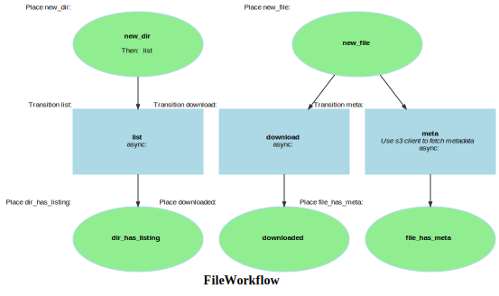

Markdown for FileWorkflow




---
## Transition: list

### list.Guard

onGuardList()
        // 
        // 

```php
#[AsGuardListener(WF::WORKFLOW_NAME, WF::TRANSITION_LIST)]
public function onGuardList(GuardEvent $event): void
{
    $file = $this->getFile($event);
    if (!$file->isDir) {
        $event->setBlocked(true, "only directories can be listed");
    }
}
```
[View source](mediary/blob/main/src/Workflow/FileWorkflow.php#L29-L35)

### list.Transition

onList()
        // 
        // 

```php
#[AsTransitionListener(WF::WORKFLOW_NAME, WF::TRANSITION_LIST)]
public function onList(TransitionEvent $event): void
{
    $file = $this->getFile($event);
    $results = $this->storageService->syncDirectoryListing($file->storageId, $file->path);
    $this->storageService->dispatchDirectoryRequests($results);

}
```
[View source](mediary/blob/main/src/Workflow/FileWorkflow.php#L38-L44)


