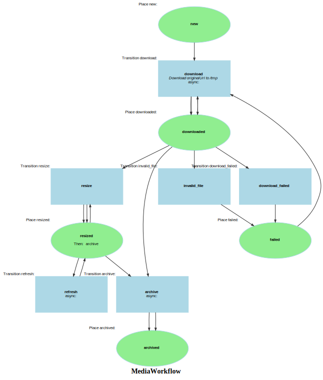

Markdown for MediaWorkflow




---
## Transition: download

### download.Transition

onDownload()
        // Download originalUrl to /tmp
        // 

```php
    #[AsTransitionListener(WF::WORKFLOW_NAME, MediaFlowDefinition::TRANSITION_DOWNLOAD)]
    public function onDownload(TransitionEvent $event): void
    {
        /** @var Media medi+a */
        $media = $this->getMedia($event);
        $url = $media->getOriginalUrl();

//        $url = 'https://ciim-public-media-s3.s3.eu-west-2.amazonaws.com/ramm/41_2005_3_2.jpg';
//        $url = 'https://coleccion.museolarco.org/public/uploads/ML038975/ML038975a_1733785969.webp';
//        $media->setOriginalUrl($url);
        // we use the original extension

        $uri = parse_url($url, PHP_URL_PATH);
        $ext = pathinfo($uri, PATHINFO_EXTENSION);
        $user = $this->userRepository->find($media->getRoot());

        //dd($media,$user);

        assert($user, "missing user/client {$media->getRoot()}, all media must have a root");
        $path = $media->getRoot() . '/' . SaisClientService::calculatePath($user->approxImageCount, $media->getCode());
        if (empty($ext)) {
            $ext = 'tmp'; // Will be corrected after download based on actual mime type
        }
        $media->setExt($ext);
//        dump(__METHOD__, $path);

//        // fix the extension issue, maybe better in a one-off iterator/workflow
//        if ($this->defaultStorage->has($path)) {
//            $this->logger->warning("Adding $ext to $path");
//            $this->defaultStorage->move($path, $path . ".$ext");
//            $media->setPath($path . ".$ext");
//        }

        $path .= '.' . $ext;
        if (!is_dir($this->tempDir)) {
            mkdir($this->tempDir, 0777, true);
        }
        assert($path, "Missing $path");
        $tempFile = $this->tempDir . '/' . str_replace('/', '-', $path);
//        $tempFile = $media->getCode() . '.' . pathinfo($url, PATHINFO_EXTENSION);// no dirs


        $media->statusCode = 200;

        // Check if media is already fully processed (has resized data, proper status and a file size in bytes)
        if ($media->resizedCount && $media->statusCode === 200 && $media->size) {
            $this->logger->info("Media {$media->getCode()} already processed, skipping download and processing");
            return;
        }

        // if we have size, we've already downloaded the important data.
        if (!$media->size) {
            try {
                $this->downloadUrl($url, $tempFile);
                $fileData = $this->processTempFile($tempFile, $media);
                $tempFile = $fileData['tempFile'];
                $mimeType = $fileData['mimeType']??null;
                $newExt = $fileData['ext'];
                //patch $path
                $path = str_replace('.' . $ext, '.' . $newExt, $path);
                $media
                    ->setPath($path)
                    ->setOriginalUrl($url);
            } catch (\Exception $e) {
                $media->setStatusCode($e->getCode());
                return;
            }
            // we could move to onComplete but we need to pass the temp file
            if (file_exists($tempFile)) {
                $media->tempFilename = $tempFile;
            }
        }
        if (!file_exists($tempFile) || !is_readable($tempFile) || filesize($tempFile) == 0) {
            throw new \Exception("Invalid temp file $tempFile");
        }
//        dd($ext, $url, $uri);
        // if there's no ext, it's a lot more work to get it from the image itself!
//        assert($ext, "@todo: handle missing extension " . $media->getOriginalUrl());


        return;

        $existingFilters = $media->getFilters();

        // @todo: filters, dispatch a synced message since we're in the download
        foreach ($message->getFilters() as $filter) {

            if (!$resized = $this->thumbRepository->findOneBy([
                'media' => $media,
                'liipCode' => $filter
            ])) {
                $resized = new Thumb($media, $filter);
                $this->entityManager->persist($resized);
            }
        }
        // side effect of resize is that media is updated with the filter sized.
        $this->entityManager->flush();
    }
```
[View source](sais/blob/main/src/Workflow/MediaWorkflow.php#L95-L192)

### download.Completed

onDownloadCompleted()
        // Download originalUrl to /tmp
        // 

```php
    #[AsCompletedListener(WF::WORKFLOW_NAME, MediaFlowDefinition::TRANSITION_DOWNLOAD)]
    public function onDownloadCompleted(CompletedEvent $event): void
    {
        $media = $this->getMedia($event);
        // upload to localStorage first, so it can be resized
        if ($media->tempFilename && file_exists($media->tempFilename)) {
            $this->uploadUrl($media->tempFilename, 'local',  $this->localStorage, $media);
        }


        $statusCode = $media->getStatusCode();
        $retryCodes = [500, 502, 503, 504, 408, 429];
        $mimeType = (string) $media->getMimeType();

        //if the status code is not 200, then mark as TRANSITION_DOWNLOAD_FAILED
        if ($statusCode !== 200) {
            $this->mediaWorkflow->apply($media, MediaFlowDefinition::TRANSITION_DOWNLOAD_FAILED);
            $this->logger->warning("Download failed for media {$media->getCode()}: $statusCode");
            // if the status code is in the retry codes, we throw exception to retry the download
            if (in_array($statusCode, $retryCodes)) {
                throw new \Exception("Download failed for media {$media->getCode()}: $statusCode");
            }
            return;
        }


        //if $mimeType not image, video, or audio, then mark as TRANSITION_INVALID
        if (!str_starts_with($mimeType, 'image/') && !str_starts_with($mimeType, 'video/') && !str_starts_with($mimeType, 'audio/')) {
            $this->mediaWorkflow->apply($media, MediaFlowDefinition::TRANSITION_INVALID);
            $this->logger->warning("Invalid mime type for media {$media->getCode()}: $mimeType");
            return;
        }

        // if image, do resize / if audio, create cache URLs / if video, do nothing
        if($media->getSize() && str_starts_with($mimeType, 'image/')) {
            $this->resizeMedia($media, Media::FILTERS, $event->getContext());
        } elseif($media->getSize() && str_starts_with($mimeType, 'audio/')) {
            $this->processAudioMedia($media, Media::FILTERS, $event->getContext());
        }

        // if (!$media->getSize() || !str_starts_with((string)$media->getMimeType(), 'image/')) {
        //     $this->mediaWorkflow->apply($media, IMediaWorkflow::TRANSITION_INVALID);
        // } elseif ($media->getStatusCode() !== 200) {
        //     $this->mediaWorkflow->apply($media, IMediaWorkflow::TRANSITION_DOWNLOAD_FAILED);
        // } else {
        //     $this->resizeMedia($media, Media::FILTERS, $event->getContext());
        // }

        $this->entityManager->flush();

        $context = $event->getContext();
        if($context['mediaCallbackUrl']??null) {
            $this->apiService->dispatchWebhook($context['mediaCallbackUrl'], $media);
        }

        // eventually, when the download is complete, dispatch a webhook
//        $env = $this->messageBus->dispatch(new MediaModel(
//            $media->getOriginalUrl(), $media->getRoot(), $media->getPath(), $media->getCode()));
//        return;
//
//        $callbackUrl = match ($media->getRoot()) {
//            'test' => 'https://sais.wip/handle_media'
//        };
//        $envelope = $this->messageBus->dispatch(new SendWebhookMessage($callbackUrl,
//            new DownloadPayload($media->getCode(), $media->getThumbData())
//        ));
//        return;
////        $this->normalizer->normalize($media, 'object', ['groups' => ['media.read']]),
//        dd($envelope, $event->getContext(), $media->getMarking());


        // dispatch the callback request
    }
```
[View source](sais/blob/main/src/Workflow/MediaWorkflow.php#L195-L266)


---
## Transition: resize

### resize.Transition

onResize()
        // 
        // 

```php
#[AsTransitionListener(WF::WORKFLOW_NAME, MediaFlowDefinition::TRANSITION_RESIZE)]
public function onResize(TransitionEvent $event): void
{
    $media = $this->getMedia($event);
    $context = $event->getContext();
    $this->resizeMedia($media, Media::FILTERS, $context);
}
```
[View source](sais/blob/main/src/Workflow/MediaWorkflow.php#L508-L513)


---
## Transition: archive

### archive.Transition

onArchive()
        // 
        // 

```php
#[AsTransitionListener(WF::WORKFLOW_NAME, MediaFlowDefinition::TRANSITION_ARCHIVE)]
public function onArchive(TransitionEvent $event): void
{
    $media = $this->getMedia($event);
    $context = $event->getContext();
    if ($media->tempFilename && file_exists($media->tempFilename)) {
        $this->uploadUrl($tempFile = $media->tempFilename,
            's3',
            $this->defaultStorage, $media);
        // we're done, so delete the temp file
        unlink($tempFile); // so it doesn't fill up the disk
    }
    // @todo: on thumbnails complete, delete from local.storage?
}
```
[View source](sais/blob/main/src/Workflow/MediaWorkflow.php#L516-L528)


---
## Transition: refresh

### refresh.Transition

onRefresh()
        // 
        // 

```php
#[AsTransitionListener(WF::WORKFLOW_NAME, MediaFlowDefinition::TRANSITION_REFRESH)]
public function onRefresh(TransitionEvent $event): void
{
    $media = $this->getMedia($event);
    $thumbs = [];
    foreach ($media->getThumbs() as $thumb) {
        assert($thumb->getUrl());
        $thumbs[$thumb->liipCode] = $thumb->getUrl();
    }
    $media->resized = $thumbs;
}
```
[View source](sais/blob/main/src/Workflow/MediaWorkflow.php#L531-L540)


