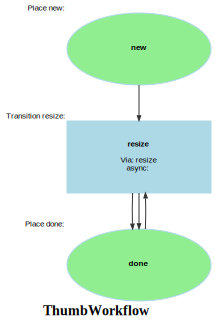

Markdown for ThumbWorkflow




---
## Transition: resize

### resize.Transition

onResize()
        // 
        // 

```php
    #[AsTransitionListener(WF::WORKFLOW_NAME, WF::TRANSITION_RESIZE)]
    public function onResize(TransitionEvent $event): void
    {
        $thumb = $this->getThumb($event);
        $media = $thumb->getMedia();
//        dd($thumb, $thumb->getMedia()->getPath());

        // the logic from filterAction
        $path = $media->getPath();
        if (!$path) {
            dd($media->getPath(), $media);
        }
        $path = PathHelper::urlPathToFilePath($path);

        $filter = $thumb->liipCode;

        $this->logger->debug("$path =>  $filter ");
        // this actually _does_ the image creation and returns the url
        $url = $this->filterService->getUrlOfFilteredImage(
            path: $path,
            filter: $filter,
            resolver: null,
            webpSupported: true
        );
        $this->logger->debug(sprintf('%s (%s) has been resolved to %s',
            $path, $filter, $url));

        // update the info in the database?  Seems like the wrong place to do this.
        // although this is slow, it's nice to know the generated size.
        $cachedUrl = $this->filterService->getUrlOfFilteredImage(
            $path,
            $filter,
            null,
            true
        );
        // $url _might_ be /resolve?
        $thumb->setUrl($cachedUrl);

//        dd($cachedUrl, parse_url($cachedUrl));
        // there's probably a way to find the path in the service somewhere, but
        // we can get it here.
        $thumbFilename = $this->publicDir . parse_url($cachedUrl, PHP_URL_PATH);
        assert(file_exists($thumbFilename));

        // we probably have this locally, but this will also work if the thumbnails are remote
//        $request = $this->httpClient->request('GET', $cachedUrl);
//        $headers = $request->getHeaders();
//        $content = $request->getContent();
        $content = file_get_contents($thumbFilename);

        /** @var Media $media */
        $size = filesize($thumbFilename); // int)$headers['content-length'][0];
        // this should be a serialized model, not a random array!
        $service = new ThumbHashService();
        $image = new \Imagick();
        $image->readImageBlob($content);
//        dd($image->getSize()); // rows, columns
        $thumb
            ->size = strlen($content);
        $thumb
            ->setW($image->getImageWidth())
            ->setH($image->getImageHeight());
//        dd($image->getImageSignature());


        if ($filter == 'small') {
            list($width, $height, $pixels) = $service->extract_size_and_pixels_with_imagick($content);
            $hash = Thumbhash::RGBAToHash($width, $height, $pixels, 192, 192);
            $key = Thumbhash::convertHashToString($hash); // You can store this in your database as a string
            $media
                ->setBlur($key);
        }

        if ($filter == 'medium') {
            try {
                $palette   = Palette::fromFilename($thumbFilename);
                $extractor = new ColorExtractor($palette);
                $media->colors    = $extractor->extract(5); // still OK if you want a quick list

                // richer analysis
                $analysis = $this->colorAnalysisService->analyze($thumbFilename, top: 5, hueBuckets: 36);
                $media->colorAnalysis = $analysis;
            } catch (\Throwable $e) {
                $this->logger->error($e->getMessage());
            }

            try {
                $hasher = new ImageHash(new PerceptualHash());  // pHash
                $hash   = $hasher->hash($thumbFilename);                 // 64-bit hash object
                $media->perceptualHash = (string) $hash;                       // hex string, store as CHAR
            } catch (\Exception $e) {
                $this->logger->error($e->getMessage());
            }
        }
        // this is done in onCompleted, too
        $media->refreshResized($filter, $size, $url);

        $this->entityManager->flush();
    }
```
[View source](sais/blob/main/src/Workflow/ThumbWorkflow.php#L51-L148)

### resize.Completed

onCompletedResize()
        // 
        // 

```php
#[AsCompletedListener(WF::WORKFLOW_NAME, MediaFlowDefinition::TRANSITION_RESIZE)]
public function onCompletedResize(CompletedEvent $event): void
{
    $thumb = $this->getThumb($event);
    $media = $thumb->getMedia();
    $media->refreshResized();
    return;

    //log class and method
    $this->logger->warning(sprintf('%s::%s', $thumb->getMedia()->getId(), $thumb->url));
    $this->logger->info(sprintf('%s::%s', __CLASS__, __METHOD__));
    //log $context['thumbCallbackUrl']
    $this->logger->debug(sprintf('Thumb Callback URL: %s', $event->getContext()['thumbCallbackUrl'] ?? 'not set'));

    $context = $event->getContext();
    if($context['thumbCallbackUrl']??null) {
        $this->apiService->dispatchWebhook($context['thumbCallbackUrl'], $thumb);
    }

}
```
[View source](sais/blob/main/src/Workflow/ThumbWorkflow.php#L151-L169)


