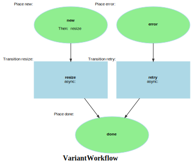

Markdown for VariantWorkflow




---
## Transition: resize

### resize.Transition

onVariantResize()
        // 
        // 

```php
    #[AsTransitionListener(WF::WORKFLOW_NAME, WF::TRANSITION_RESIZE)]
    public function onVariantResize(TransitionEvent $event): void
    {
        /** @var Variant $variant */
        $variant = $event->getSubject();
        $asset   = $variant->asset;
//        dd($asset->id, $asset->path, __METHOD__);

        $url = $this->filterService->getUrlOfFilteredImage(
            path: $asset->path,
            filter: $variant->preset,
            resolver: null,
            webpSupported: true
        );
        $this->logger->warning(sprintf('%s (%s) has been resolved to %s',
            $asset->path, $variant->preset, $url));

        // update the info in the database?  Seems like the wrong place to do this.
        // although this is slow, it's nice to know the generated size.
        $cachedUrl = $this->filterService->getUrlOfFilteredImage(
            path: $asset->path,
            filter: $variant->preset,
            resolver: null,
            webpSupported: true
        );
        $variant->url = $cachedUrl;

        // hackish, we know the absolute path
        $absolutePath = $this->publicDir . parse_url($url, PHP_URL_PATH);
        $info = ImageProbe::probe(file_get_contents($absolutePath));


        $variant->size = filesize($absolutePath);
        $variant->width = $info['width'];
        $variant->height = $info['height'];
//        dd($absolutePath, file_exists($absolutePath), $info);
//        dd($url, $cachedUrl);
//        // $url _might_ be /resolve?
//        $thumb->setUrl($cachedUrl);
        return;


        // 1) Ensure we know where the ORIGINAL is (in archive); mirror to local for Liip
        $origKey = $this->requireOriginalInArchive($asset);
        $localOrigPath = $this->mirrorOriginalToLocal($origKey);

        // 2) Generate the variant using Liip (preset == filter name)
        $binary = $this->applyLiipFilter($localOrigPath, $variant->preset);

        // 3) (Optional) run analysis from THIS variant if it's the "small" one
        //    or whatever preset you prefer for analysis.
        if (in_array($variant->preset, ['thumb','small','preview'], true)) {
            $analytics = $this->analysis->analyzeFromBytes($binary->getContent(), $binary->getMimeType());
            // You can stash results on the Asset meta (JSON) or Variant itself as you prefer.
            // Example: put on Asset meta (not shown in entity; add a JSON column if you want).
            // $asset->meta = array_replace($asset->meta ?? [], $analytics);
        }

        // 4) Write the variant to ARCHIVE storage (CDN-able), using ShardedKey
        $hex   = $asset->id;
        $ext   = $this->extFromMime($binary->getMimeType()) ?? $variant->format ?? 'webp';
        $vKey  = ShardedKey::variantKey($hex, $variant->preset, $ext);
        $this->archiveStorage->write($vKey, $binary->getContent());

        // 5) Fill variant metadata quickly
        $probe = ImageProbe::probe($binary->getContent());
        $variant->storageBackend = 'archive';
        $variant->storageKey     = $vKey;
        $variant->url            = $this->publicUrl($vKey);
        $variant->format         = $ext;
        $variant->size           = \strlen($binary->getContent());
        $variant->width          = $probe['width'] ?? $variant->width;
        $variant->height         = $probe['height'] ?? $variant->height;
        $variant->touch();

        // 6) Archive original *after* we’ve generated at least one variant + analysis
        //    In your current design, the original is already in archive; if not,
        //    move from temp->archive here.

        // 7) Remove the local ORIGINAL to keep disk tidy
        $this->unlinkLocalPath($localOrigPath);
    }
```
[View source](sais/blob/main/src/Workflow/VariantWorkflow.php#L44-L125)

### resize.Completed

onVariantResizeCompleted()
        // 
        // 

```php
#[AsCompletedListener(WF::WORKFLOW_NAME, WF::TRANSITION_RESIZE)]
public function onVariantResizeCompleted(CompletedEvent $event): void
{
    /** @var Variant $variant */
    $variant = $event->getSubject();
    $asset   = $variant->asset;

    // Are all required presets done?
    $required = $this->variantPlan->requiredPresetsForAsset($asset->mime ?? '');
    if ($required === []) {
        return;
    }

    $done = [];
    foreach ($asset->variants as $v) {
        if ($v->marking === WF::PLACE_DONE) {
            $done[$v->preset] = true;
        }
    }

    foreach ($required as $preset) {
        if (!isset($done[$preset])) {
            // Still waiting on others
            return;
        }
    }

    // extract features based on site

    // All required variants are done — kick Asset->analyze
    if (false) // this don't pass the smell test.
    if ($this->assetWorkflow->can($asset, AWF::TRANSITION_ANALYZE)) {
        $this->assetWorkflow->apply($asset, AWF::TRANSITION_ANALYZE);
        $this->logger->info('Triggered asset analyze after all variants done', [
            'hash' => $asset->id, 'presets' => $required
        ]);
    }
}
```
[View source](sais/blob/main/src/Workflow/VariantWorkflow.php#L132-L168)


