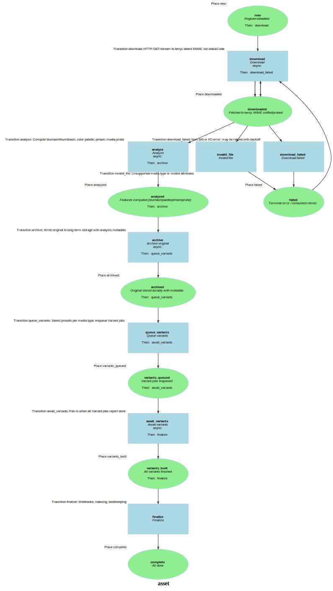

Markdown for asset




---
## Transition: download

### download.Transition

onDownload()
        // Download
        // HTTP GET/stream to temp; detect MIME; set statusCode

```php
    #[AsTransitionListener(WF::WORKFLOW_NAME, MediaFlowDefinition::TRANSITION_DOWNLOAD)]
    public function onDownload(TransitionEvent $event): void
    {
        $asset = $this->getAsset($event);
        $url = $asset->originalUrl;

//        $url = 'https://ciim-public-media-s3.s3.eu-west-2.amazonaws.com/ramm/41_2005_3_2.jpg';
//        $url = 'https://coleccion.museolarco.org/public/uploads/ML038975/ML038975a_1733785969.webp';
//        $asset->setOriginalUrl($url);
        // we use the original extension

        $uri = parse_url($url, PHP_URL_PATH);
        $ext = pathinfo($uri, PATHINFO_EXTENSION);

        if (empty($ext)) {
            $ext = 'tmp'; // Will be corrected after download based on actual mime type
        }
        $asset->ext = $ext;

        // Check if asset is already fully processed (has resized data, proper status and a file size in bytes)
        if ($asset->resizedCount && $asset->size) {
            $this->logger->info("Asset {$asset->id} already processed, skipping download and processing");
            return;
        }

        $path = ShardedKey::originalKey($asset->id) . "." . $ext;

        if (!is_dir($this->tempDir)) {
            mkdir($this->tempDir, 0777, true);
        }
        assert($path, "Missing $path");
        $tempFile = $this->tempDir . '/' . str_replace('/', '-', $path);
        $asset->statusCode = 200;
        // path will change if there is an extension mismatch!
        [$path, $absolutePath] = $this->downloadFileToLocalStorage($url, $path);

            $fileData = $this->processLocalFile($absolutePath, $asset);
            try {
            } catch (\Exception $e) {
                $asset->statusCode = $e->getCode();
                return;
            }
            $asset->tempFilename = $absolutePath;
    }
```
[View source](sais/blob/main/src/Workflow/AssetWorkflow.php#L98-L140)


---
## Transition: analyze

### analyze.Transition

onAnalyze()
        // Analyze
        // Compute blurhash/thumbhash, color palette, pHash, media probe

```php
#[AsTransitionListener(WF::WORKFLOW_NAME, WF::TRANSITION_ANALYZE)]
public function onAnalyze(TransitionEvent $event): void
{
    $asset   = $this->getAsset($event);
    $context = $event->getContext();
    return;

    // Guard: only analyze images for now; audio/video can get their own probes
    if (!$asset->mime || !str_starts_with($asset->mime, 'image/')) {
        $this->logger->info("Skipping analysis for non-image asset {$asset->contentHashHex()} ({$asset->mime})");
        return;
    }

    // Source path (Liip expects a web URL path, not fs); adapt to your storage scheme
    $sourceUrlPath = $asset->storageKey ?? $asset->originalUrl;
    if (!$sourceUrlPath) {
        $this->logger->warning("Asset {$asset->contentHashHex()} has no sourceUrlPath for analysis.");
        return;
    }

    // Run previews/analysis on small + medium variants
    $presets = $context['presets'] ?? ['small','medium'];
        $results = $this->assetPreviewService->processPresets($asset, $sourceUrlPath, $presets);
        $this->logger->info("Analysis complete for {$asset->id}", $results);
    try {
    } catch (\Throwable $e) {
        $this->logger->error("Analysis failed for {$asset->id}: {$e->getMessage()}");
    }

    $this->em->persist($asset);
    $this->em->flush();
}
```
[View source](sais/blob/main/src/Workflow/AssetWorkflow.php#L280-L310)


