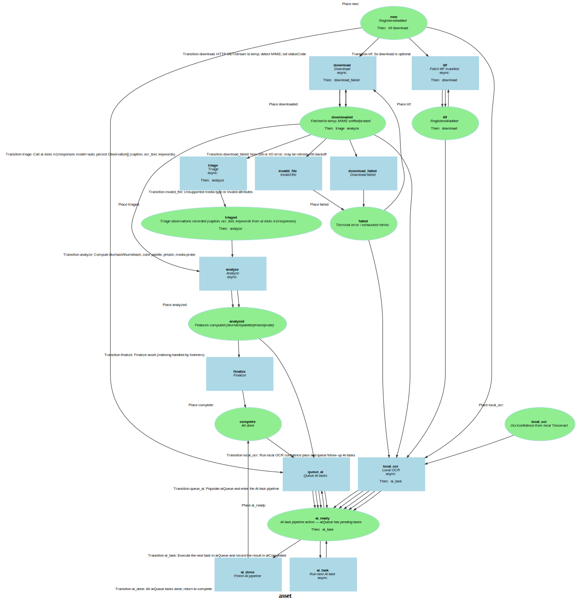

Markdown for asset




---
## Transition: download

### download.Transition

onDownload()
        // Download
        // HTTP GET/stream to temp; detect MIME; set statusCode

```php
    #[AsTransitionListener(WF::WORKFLOW_NAME, AssetFlow::TRANSITION_DOWNLOAD)]
    public function onDownload(TransitionEvent $event): void
    {
        $asset = $this->getAsset($event);
        $downloadUrl = null;
        $url = $asset->originalUrl;

//        $url = 'https://ciim-public-media-s3.s3.eu-west-2.amazonaws.com/ramm/41_2005_3_2.jpg';
//        $url = 'https://coleccion.museolarco.org/public/uploads/ML038975/ML038975a_1733785969.webp';
//        $asset->setOriginalUrl($url);
        // we use the original extension

        $uri = parse_url($url, PHP_URL_PATH);
        $ext = pathinfo($uri, PATHINFO_EXTENSION);

        if (empty($ext)) {
            $ext = 'tmp'; // Will be corrected after download based on actual mime type
        }
        $asset->ext = $ext;

        $key = $this->archiveService->keyForUrl($asset->originalUrl);
        $path = basename($this->archiveService->payloadPath($key, $ext));

        if (!is_dir($this->tempDir)) {
            mkdir($this->tempDir, 0777, true);
        }
        assert($path, "Missing $path");
        $tempFile = $this->tempDir . '/' . str_replace('/', '-', $path);
        $asset->statusCode = 200;
        // path will change if there is an extension mismatch!
        // Download to a process-local temp file (not persisted)
        $tmpFile = tempnam(sys_get_temp_dir(), 'asset_');
        $uploadPath = $tmpFile;
        try {
            $downloadCandidates = $this->downloadCandidates($asset);
            $lastError = null;
            foreach ($downloadCandidates as $candidateUrl) {
                try {
                    $this->downloadUrl($candidateUrl, $tmpFile);
                    $downloadUrl = $candidateUrl;
                    break;
                } catch (UnrecoverableMessageException|\Throwable $e) {
                    $lastError = $e;
                    $this->logger->warning('Download candidate failed for {id}: {url} ({error})', [
                        'id' => $asset->id,
                        'url' => $candidateUrl,
                        'error' => $e->getMessage(),
                    ]);
                    continue;
                }
            }

            if ($downloadUrl === null) {
                if ($lastError instanceof \Throwable) {
                    throw $lastError;
                }
                throw new RuntimeException(sprintf('No downloadable URL candidates for asset %s', $asset->id));
            }

            $asset->context ??= [];
            $asset->context['download_url'] = $downloadUrl;

            if (!is_file($tmpFile) || filesize($tmpFile) === 0) {
                throw new RuntimeException(sprintf('Downloaded zero-byte payload for asset %s', $asset->id));
            }

            // no network calls! Only what we need while we have local
            // Inspect local file once: size, mime, dimensions, exif (when applicable)
            $this->processLocalFile($tmpFile, $asset);
            $asset->context ??= [];
            $asset->context['source_probe'] = [
                'mime' => $asset->mime,
                'width' => $asset->width,
                'height' => $asset->height,
                'bytes' => $asset->size,
                'url' => $downloadUrl,
            ];
            $this->applyEdgeAnalysisFromLocalFile($asset, $tmpFile);

            // Normalize extension based on detected mime type
            $detectedExt = ImageProbe::extFromMime($asset->mime);
            $currentExt = pathinfo($tmpFile, PATHINFO_EXTENSION);
            if ($detectedExt && $currentExt !== $detectedExt) {
                $renamed = $tmpFile . '.' . $detectedExt;
                rename($tmpFile, $renamed);
                $tmpFile = $renamed;
                $asset->ext = $detectedExt;
            }
            $uploadPath = $tmpFile;

            // tasks[] controls which analysis steps to run for this asset.
            // Sent by ssai in context hints; defaults to all tasks if absent.
            $tasks = $asset->context['tasks'] ?? ['thumbhash', 'palette'];

            // OCR — while the file is local, no second download needed
            if (str_starts_with((string) $asset->mime, 'image/')) {
                // Thumbhash — resize to ≤100px before extracting pixels (thumbhash max is 192x192)
                if (in_array('thumbhash', $tasks, true)) {
                    try {
                        $img = new \Imagick($tmpFile);
                        $img->thumbnailImage(100, 100, bestfit: true);
                        $tw = $img->getImageWidth();
                        $th = $img->getImageHeight();
                        $pixels = [];
                        $iter = $img->getPixelIterator();
                        foreach ($iter as $row) {
                            foreach ($row as $pixel) {
                                $c = $pixel->getColor(2);
                                $pixels[] = $c['r'];
                                $pixels[] = $c['g'];
                                $pixels[] = $c['b'];
                                $pixels[] = $c['a'];
                            }
                        }
                        $img->clear();
                        $hash = Thumbhash::RGBAToHash($tw, $th, $pixels, 192, 192);
                        $asset->context['thumbhash'] = Thumbhash::convertHashToString($hash);
                        unset($pixels, $iter, $img);
                    } catch (\Throwable $e) {
                        $this->logger->warning('Thumbhash failed for {id}: {err}', ['id' => $asset->id, 'err' => $e->getMessage()]);
                    }
                }

                if (in_array('palette', $tasks, true)) {
                    $this->assetPreviewService->maybeComputePaletteAndPhash($asset, self::THUMBHASH_PRESET, $tmpFile);
                }
            }

            // Build canonical payload while we still have local bytes.
            $uploadPath = $this->buildCanonicalAsset($asset, $tmpFile);

            // Persist local canonical/small derivatives for shared AI-tools access.
            $uploadPath = $this->persistLocalDerivatives($asset, $uploadPath);

            // Archive to S3 — now after all local analysis is done
            $this->uploadToArchiveFromPath($asset, $uploadPath);
        } finally {
            if (is_file($tmpFile)) {
                unlink($tmpFile);
            }
            if (
                is_string($uploadPath)
                && $uploadPath !== $tmpFile
                && $uploadPath !== $asset->localCanonicalFilename
                && is_file($uploadPath)
            ) {
                unlink($uploadPath);
            }
        }

        // now we can save everything and move to the next step.
        $this->em->flush();
    }
```
[View source](mediary/blob/main/src/Workflow/AssetWorkflow.php#L477-L628)


---
## Transition: local_ocr

### local_ocr.Transition

onLocalOcr()
        // Local OCR
        // Run local OCR confidence pass and queue follow-up AI tasks

```php
#[AsTransitionListener(WF::WORKFLOW_NAME, AssetFlow::TRANSITION_LOCAL_OCR)]
public function onLocalOcr(TransitionEvent $event): void
{
    $asset = $this->getAsset($event);
    $sourceUrl = $this->preferredLocalOcrUrl($asset);
    if ($sourceUrl === null) {
        $this->logger->warning('Local OCR skipped for {id}: no source URL', ['id' => $asset->id]);
        return;
    }

    $analysis = $this->aiToolsOcrService->analyzeUrl($sourceUrl);
    if (!is_array($analysis) || $analysis === []) {
        $this->logger->warning('Local OCR returned no result for {id}', ['id' => $asset->id]);
        return;
    }

    $asset->localOcrStatus = isset($analysis['status']) && is_numeric($analysis['status'])
        ? (int) $analysis['status']
        : null;
    $asset->localOcrError = is_string($analysis['error'] ?? null) ? $analysis['error'] : null;

    if (($analysis['ok'] ?? true) !== true) {
        $asset->context ??= [];
        $asset->context['local_ocr'] = $analysis;
        $this->em->flush();
        return;
    }

    $ocr = $analysis['ocr'] ?? [];
    if (!is_array($ocr)) {
        $ocr = [];
    }

    $asset->context ??= [];
    $asset->context['local_ocr'] = $analysis;
    if (isset($ocr['text']) && is_string($ocr['text']) && trim($ocr['text']) !== '') {
        $asset->context['ocr'] = mb_substr($ocr['text'], 0, 20000);
        $asset->context['ocr_chars'] = mb_strlen($asset->context['ocr']);
    }

    $asset->localOcrText = is_string($ocr['text'] ?? null) ? trim((string) $ocr['text']) : null;
    $asset->localOcrConfidence = isset($ocr['mean_confidence']) && is_numeric($ocr['mean_confidence'])
        ? (float) $ocr['mean_confidence']
        : null;
    $asset->localOcrPrimaryType = is_string($analysis['primary_type'] ?? null) ? $analysis['primary_type'] : null;
    $asset->localOcrSourceUrl = $sourceUrl;
    $asset->localOcrProvider = 'ai-tools';
    $asset->localOcrModel = 'tesseract';
    $asset->localOcrAt = new \DateTimeImmutable();
    $asset->localOcrStatus = 200;
    $asset->localOcrError = null;

    if ($asset->aiDocumentType === null && is_string($asset->localOcrPrimaryType) && $asset->localOcrPrimaryType !== '') {
        $asset->aiDocumentType = $asset->localOcrPrimaryType;
    }

    $tasks = $this->localOcrNextTasks($analysis);
    if ($tasks !== []) {
        $asset->aiQueue = array_values(array_unique(array_merge($asset->aiQueue, $tasks)));
    }

    $this->em->flush();
}
```
[View source](mediary/blob/main/src/Workflow/AssetWorkflow.php#L243-L304)


---
## Transition: iiif

### iiif.Transition

onFetchIiif()
        // Fetch IIIF manifest
        // So download is optional

```php
#[AsTransitionListener(WF::WORKFLOW_NAME, AssetFlow::TRANSITION_FETCH_IIIF)]
public function onFetchIiif(TransitionEvent $event): void
{
    $asset = $this->getAsset($event);

    $hints = is_array($asset->sourceMeta) ? $asset->sourceMeta : [];
    $manifestRef = $hints['iiif_manifest'] ?? $hints['iiifManifest'] ?? null;

    if ($manifestRef === null || $manifestRef === '') {
        return;
    }

    try {
        $cachedManifest = $asset->iiifManifestEntity?->manifestJson;
        if (!isset($hints['iiif_manifest_json']) && is_array($cachedManifest) && $cachedManifest !== []) {
            $hints['iiif_manifest_json'] = $cachedManifest;
        }

        if (is_string($manifestRef) && !isset($hints['iiif_manifest_json'])) {
            $tmpFile = tempnam(sys_get_temp_dir(), 'iiif_manifest_');
            if ($tmpFile === false) {
                throw new RuntimeException('Unable to allocate temporary file for IIIF fetch.');
            }

            try {
                $this->downloadUrl($manifestRef, $tmpFile);
                $json = file_get_contents($tmpFile);
                if ($json !== false) {
                    $decoded = json_decode($json, true);
                    if (is_array($decoded)) {
                        $hints['iiif_manifest_json'] = $decoded;
                    }
                }
            } finally {
                if (is_file($tmpFile)) {
                    @unlink($tmpFile);
                }
            }
        }

        $hints = $this->iiifManifestService->attachFromContextHints($asset, $hints);
        $asset->sourceMeta = array_replace($asset->sourceMeta ?? [], $hints);

        $metadataMap = $this->iiifMetadataMap($asset->iiifManifestEntity?->manifestJson ?? null);

        // Fill canonical source metadata conservatively: only when empty.
        if (!isset($asset->sourceMeta['dcterms:title']) || trim((string) $asset->sourceMeta['dcterms:title']) === '') {
            $title = trim((string) ($asset->iiifManifestEntity?->label ?? ''));
            if ($title === '') {
                $title = $this->firstIiifValue($metadataMap, ['title']);
            }
            if ($title !== '') {
                $asset->sourceMeta['dcterms:title'] = $title;
            }
        }

        if (!isset($asset->sourceMeta['dcterms:description']) || trim((string) $asset->sourceMeta['dcterms:description']) === '') {
            $description = $this->firstIiifValue($metadataMap, ['description', 'summary', 'abstract']);
            if ($description !== '') {
                $asset->sourceMeta['dcterms:description'] = $description;
            }
        }

        // Keep parsed IIIF facets in sourceMeta for indexing/debug.
        $asset->sourceMeta ??= [];
        if (!isset($asset->sourceMeta['iiif_subjects'])) {
            $subjects = $this->iiifValues($metadataMap, ['subject', 'subjects', 'topic', 'topics']);
            if ($subjects !== []) {
                $asset->sourceMeta['iiif_subjects'] = $subjects;
            }
        }
        if (!isset($asset->sourceMeta['iiif_keywords'])) {
            $keywords = $this->iiifValues($metadataMap, ['keyword', 'keywords']);
            if ($keywords !== []) {
                $asset->sourceMeta['iiif_keywords'] = $keywords;
            }
        }

        // Once IIIF metadata is available, prefer a deterministic IIIF-derived thumbnail
        // over any earlier fallback/insecure value.
        $iiifThumb = $this->extractUrlFromMixed($asset->sourceMeta['iiif_thumbnail_url'] ?? null)
            ?? $this->extractUrlFromMixed($asset->sourceMeta['thumbnail_url'] ?? null)
            ?? $this->iiifThumbnailUrl($asset);

        if (is_string($iiifThumb) && $iiifThumb !== '') {
            $asset->smallUrl = $iiifThumb;
        }

        $this->em->flush();
    } catch (UnrecoverableMessageException $e) {
        $asset->sourceMeta ??= [];
        $asset->sourceMeta['iiif_error'] = $e->getMessage();
        $this->logger->warning('Skipping IIIF manifest fetch for {id}: {message}', [
            'id' => $asset->id,
            'message' => $e->getMessage(),
        ]);
        $this->em->flush();
    }
}
```
[View source](mediary/blob/main/src/Workflow/AssetWorkflow.php#L373-L470)


---
## Transition: triage

### triage.Transition

onTriage()
        // Triage
        // Call ai-tools /v1/responses model=auto; persist Observation[] (caption, ocr_text, keywords).

```php
#[AsTransitionListener(WF::WORKFLOW_NAME, AssetFlow::TRANSITION_TRIAGE)]
public function onTriage(TransitionEvent $event): void
{
    $asset = $this->getAsset($event);
    if (!$asset->mime || !str_starts_with($asset->mime, 'image/')) {
        $this->logger->info('Skipping triage for non-image asset {id} ({mime})', [
            'id' => $asset->id,
            'mime' => $asset->mime,
        ]);
        return;
    }

    $imageUrl = $this->preferredTriageImageUrl($asset);
    if ($imageUrl === null) {
        throw new RuntimeException(sprintf('No triage image URL available for asset %s.', $asset->id));
    }

    $startedAt = microtime(true);
    $payload = $this->aiToolsObserveService->observeImage($imageUrl, 'auto');
    $claims = is_array($payload['claims'] ?? null) ? $payload['claims'] : [];
    $run = is_array($payload['run'] ?? null) ? $payload['run'] : [];

    $asset->context ??= [];
    $asset->context['triage'] = [
        'ok' => true,
        'source_url' => $imageUrl,
        'schema_version' => $payload['schema_version'] ?? null,
        'claims' => $claims,
        'run' => $run,
        'duration_ms' => (int) round((microtime(true) - $startedAt) * 1000),
        'at' => (new \DateTimeImmutable())->format(\DateTimeInterface::ATOM),
    ];

    $classification = $this->firstClaimValue($claims, 'observe:classification');
    if ($classification !== null) {
        $asset->localOcrPrimaryType = $classification;
        $asset->aiDocumentType = $classification;
    }

    $text = $this->longestClaimValue($claims, 'observe:text');
    if ($text !== null && trim($text) !== '') {
        $asset->localOcrText = mb_substr(trim($text), 0, 20000);
        $asset->context['ocr'] = $asset->localOcrText;
        $asset->context['ocr_chars'] = mb_strlen($asset->localOcrText);
    }

    $asset->localOcrSourceUrl = $imageUrl;
    $asset->localOcrProvider = 'ai-tools';
    $asset->localOcrModel = is_string($run['model'] ?? null) ? $run['model'] : 'auto';
    $asset->localOcrAt = new \DateTimeImmutable();
    $asset->localOcrStatus = 200;
    $asset->localOcrError = null;

    $this->recordCompletedTask($asset, 'triage', [
        'schema_version' => $payload['schema_version'] ?? null,
        'claims' => $claims,
        'run' => $run,
        'source_url' => $imageUrl,
    ]);

    $this->logger->info('Asset triage recorded {count} claims for {id}', [
        'count' => count($claims),
        'id' => $asset->id,
    ]);
}
```
[View source](mediary/blob/main/src/Workflow/AssetWorkflow.php#L307-L370)


---
## Transition: analyze

### analyze.Transition

onLocalAnalyze()
        // Analyze
        // Compute blurhash/thumbhash, color palette, pHash, media probe

```php
    #[AsTransitionListener(WF::WORKFLOW_NAME, WF::TRANSITION_ANALYZE)]
    public function onLocalAnalyze(TransitionEvent $event): void
    {
        // Analysis now happens AFTER archive using S3-backed URLs
        $asset = $this->getAsset($event);

        if (!$asset->mime || !str_starts_with($asset->mime, 'image/')) {
            $this->logger->info("Skipping analysis for non-image asset ({$asset->mime})");
            return;
        }

        // Thumbhash and palette were computed in onDownload while the file was local.
        // Only fall back to the archive URL fetch if they're missing (e.g. older assets).
        $asset->context ??= [];
        $tasks = $asset->context['tasks'] ?? ['thumbhash', 'palette'];

        if (in_array('ocr', $tasks, true) && empty($asset->context['ocr'])) {
            $ocrSourceUrl = $asset->smallUrl ?? $asset->archiveUrl ?? null;
            if ($ocrSourceUrl) {
                $ocrTmp = tempnam(sys_get_temp_dir(), 'asset_ocr_');
                if ($ocrTmp !== false) {
                    try {
                        $this->downloadUrl($ocrSourceUrl, $ocrTmp);
                        $ocrText = $this->ocrService->extractText($ocrTmp, $asset->mime);
                        if ($ocrText !== null && $ocrText !== '') {
                            $asset->context['ocr'] = $ocrText;
                            $asset->context['ocr_chars'] = mb_strlen($ocrText);
                        }
                    } finally {
                        if (is_file($ocrTmp)) {
                            unlink($ocrTmp);
                        }
                    }
                }
            }
        }

        if (empty($asset->context['thumbhash']) && $asset->archiveUrl) {
            $localForThumbhash = $this->localImagePath($asset, preferSmall: true);
            if (is_string($localForThumbhash) && $localForThumbhash !== '') {
                $this->logger->info('onLocalAnalyze: thumbhash missing, using local small derivative');
                [$tw, $th, $pixels] = $this->resizeForThumbHash($localForThumbhash, 100);
                $hash = Thumbhash::RGBAToHash($tw, $th, $pixels, 192, 192);
                $asset->context['thumbhash'] = Thumbhash::convertHashToString($hash);
                unset($pixels);
            } else {
                $this->logger->info('onLocalAnalyze: thumbhash missing, fetching from archive URL (fallback)');
                [$tw, $th, $pixels] = $this->assetPreviewService->resizeForThumbHashFromUrl($asset->archiveUrl);
                $hash = Thumbhash::RGBAToHash($tw, $th, $pixels, 192, 192);
                $asset->context['thumbhash'] = Thumbhash::convertHashToString($hash);
                unset($pixels);
            }
        }

        if (empty($asset->context['colors']) && $asset->archiveUrl) {
            $localForPalette = $this->localImagePath($asset, preferSmall: true);
            $this->assetPreviewService->maybeComputePaletteAndPhash(
                $asset,
                self::THUMBHASH_PRESET,
                $localForPalette ?? $asset->archiveUrl
            );
        }

        $this->em->flush();
//        $this->em->detach($asset);
    }
```
[View source](mediary/blob/main/src/Workflow/AssetWorkflow.php#L663-L727)


---
## Transition: ai_task

### ai_task.Transition

onAiTask()
        // Run next AI task
        // Execute the next task in aiQueue and record the result in aiCompleted

```php
#[AsTransitionListener(WF::WORKFLOW_NAME, AssetFlow::TRANSITION_AI_TASK)]
public function onAiTask(TransitionEvent $event): void
{
    $asset = $this->getAsset($event);
    $this->runNextAiTask($asset);
    $this->em->flush();
}
```
[View source](mediary/blob/main/src/Workflow/AssetWorkflow.php#L235-L240)


