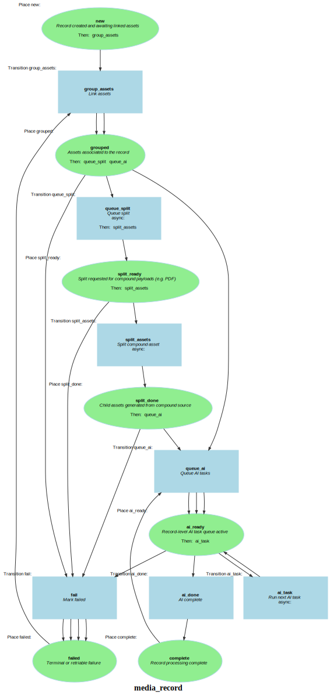

Markdown for media_record




---
## Transition: split_assets

### split_assets.Transition

onSplitAssets()
        // Split compound asset
        // 

```php
#[AsTransitionListener(MediaRecordFlow::WORKFLOW_NAME, MediaRecordFlow::TRANSITION_SPLIT_ASSETS)]
public function onSplitAssets(TransitionEvent $event): void
{
    $record = $this->getRecord($event);
    $record->context ??= [];
    $record->context['split'] = [
        'status' => 'queued',
        'at' => (new \DateTimeImmutable())->format(DATE_ATOM),
        'note' => 'Split workflow scaffolded; implement PDF/page extraction next.',
    ];
    $this->entityManager->flush();
}
```
[View source](mediary/blob/main/src/Workflow/MediaRecordWorkflow.php#L22-L32)


---
## Transition: ai_task

### ai_task.Transition

onAiTask()
        // Run next AI task
        // 

```php
#[AsTransitionListener(MediaRecordFlow::WORKFLOW_NAME, MediaRecordFlow::TRANSITION_AI_TASK)]
public function onAiTask(TransitionEvent $event): void
{
    $record = $this->getRecord($event);
    $nextTask = array_shift($record->aiQueue);
    if (!is_string($nextTask) || $nextTask === '') {
        return;
    }

    $record->aiCompleted[] = [
        'task' => $nextTask,
        'at' => (new \DateTimeImmutable())->format(DATE_ATOM),
        'result' => [
            'status' => 'queued',
            'note' => 'MediaRecord AI workflow scaffolded; task execution to be implemented.',
        ],
    ];

    $this->logger->info('MediaRecord AI task scaffold processed for {id}: {task}', [
        'id' => $record->id,
        'task' => $nextTask,
    ]);

    $this->entityManager->flush();
}
```
[View source](mediary/blob/main/src/Workflow/MediaRecordWorkflow.php#L35-L58)


